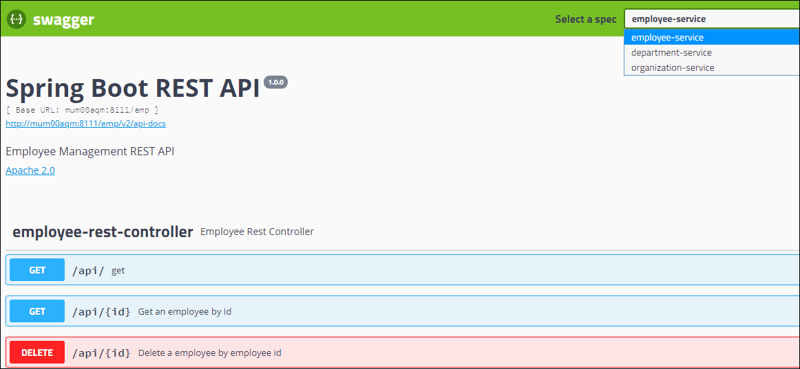

# Cloud Comp Organization Management System [CCOMS]

  

Table of contents
=================

<!--ts-->
   * [Abstract](#abstract)
   * [System Requirements](#system-requirements)
   * [Existing System](#existing-system)
      * [Monolithic Architecture](#monolithic-architecture)
   * [Demerits of Existing System](#demerits-of-existing-system)
   * [Data flow Diagrams](#data-flow-diagram)
   * [Proposed System](#proposed-system)
   * [Advantages](#advantages)
   * [How automation works](#how-automation-works)
   * [Operational activities](#operational-activities)
   * [Best Dev-Ops Practices](#best-devops-practices)
<!--te-->

Abstract
========

System Requirements
===================

Existing System
===============

Demerits of Existing System
===========================

Data flow Diagrams
==================

Proposed System
===============

Advantages
=========

How Automation Works
====================

Operational activities
====================

Best Dev-Ops Practices
======================
