# Cloud Comp Organization Management System [CCOMS]


<p align="center">
  
</p>

Table of contents
=================

<!--ts-->
   * [Abstract](#abstract)
   * [Introduction](#introduction)
   * [Software Metrics](#software-metrics)
   * [Requirement Gathering](#requirement-gathering)
   * [Implementation](#implementation)
      * [Spring Boot](#spring-boot)
      * [Maven](#maven)
      * [Ansible](#ansible)
      * [Kubernetes](#kubernetes)
      * [Jenkins](#jenkins)
      * [Helm Charts](#helmcharts)
   * [Visualization of Containers](#visualization-of-containers)
   * [Operational Activities](#operational-activities)
      * [Application Deployment on k8s](#application-deployment-on-k8s)
      * [Application Rolling Update on k8s](#application-rolling-update-on-k8s)
      * [Rolling back Application on k8s](#rolling-back-application-on-k8s)
      * [Kubernetes Cluster Deployemnt](#kubernetes-cluster-deployment)  
      * [Kubernetes Cluster Upgrade](#kubernetes-cluster-upgrade)
      * [Ansible Password Rotation](#ansible-password-rotation)
      * [Application Password Rotation](#application-password-rotation)
      * [Autoscalling of Microservices](#autoscalling-of-microservices)
      * [Backup and Restoration of k8s resources using Heptio Velero](#backup-and-restoration-of-k8s-resources-using-heptio-velero)
   * [Monitoring](#monitoring)
   * [Dev-Ops Best Practices](#devops-best-practices)
   * [Development Setup](#development-setup)
   * [Objectives](#objectives)
<!--te-->

Abstract
========
**CCOMS is a Organization Managament System Microservices based project. Purpose of creating this project is to understand and work on all Devops technologies. Live project will help you to understand or map all devops tools easily, that is why i have created this project.**

Introduction
============

I have created three different microservices, which communicates with each other trough REST API.</br>
- Employee
- Department
- Organization
- Proxy
- Config

There is nothing special in these microservices.
- I have used spring boot dependencies to build spring boot based project and deployed it on kubernetes.

Purpose of creating the organization
-----------------------------------
To uniquely identify project across all th projects, I have created CCOMS organization intentionally. </br>
Below is the groupid that i have used in maven project. </br>
```
<groupId>com.cloudcomp.ccoms</groupId>
com -- for commercial
cloudcomp -- Organization name
ccoms -- Organization Management System Project
```
Software Metrics
===================

|Category                    |Tools               |Subtools/Plugin     |Version   |Purpose                                                                                      |
|----------------------------|--------------------|--------------------|----------|---------------------------------------------------------------------------------------------|
|Development                 |Springboot          |springframework     |2.2.1     |Easy to develop microservices                                                               |
|                            |                    |swagger             |1.2.4     |To build documentation for all restAPIs                                                           |
|                            |                    |Config Server/Client|2.2.1     |Used distributed configuration server to store configuration                                 |
|                            |                    |Openfeign           |2.2.1     |To communicate one microservice with other microservice                                    |
|                            |                    |thymeleaf           |2.2.1     |Its modern Java template to build a web environemnt                                          |
|                            |                    |spring data mongodb |2.2.1     |To interact with mongo db                                                                    |
|                            |                    |Zuul                |2.2.1     |To use proxy server and centralize swagger, this is why we havent used ingress k8s controller|
|Project building Tool       |Maven               |Maven               |3.6.2     |To build Spring boot project                                                                 |
|                            |                    |Surefire            |          |Surefire is default plugin to generate Unit test case report [Junit and TestNG]                   |
|                            |                    |failsafe            |          |Used to generate integration test report                                                                 |
|                            |                    |jacoco              |          |Used to check criteria of newly developed code                                               |
|                            |                    |cucumber            |          |used for Behavior Driven Development                                                         |
|                            |                    |sonar               |          |Use for static code analysis                                                                 |
|                            |                    |docker              |          |to build and push image                                                                      |
|                            |                    |nexus repository    |          |to push artifact on nexus                                                                    |
|                            |                    |OWASP               |          |used for dynamic analys of code                                                              |
|UI Testing                  |Selenium            |                    |3.141.59  |UI based automation testing is done by selenium                                              |
|Performance Testing         |Jmeter              |                    |          |Load and stress testing is done by jemeter                                                   |
|Artifact Repository         |Nexus               |                    |3.13      |Used to store artifact of monolithic application                                             |
|                            |Docker Hub          |                    |          |Used private and public repositories to store docker images                                  |
|Version Control tool        |git                 |                    |2.9.2     |to work with multiple developers and on multiple feature.                                    |
|Containerization            |Docker              |                    |18.09.8-ol|to write docker files and to test application on docker before moving on to k8s              |
|Container Orchestration     |Kubernetes          |                    |1.16      |to manage and scale pods                                                                     |
|Monitoring log              |ELK with fluentd    |                    |7.4.2     |to monitor k8s cluster and pods log.                                                         |
|Monitoring infra/k8s cluster|ELK with MetricBeat |                    |7.4.2     |to monitor k8scluster                                                                        |
|                            |Weavescope          |                    |1.11.6    |to monitor k8s cluster and its service, lightweight tool and needs zero configuration        |
|Static Code analysis        |Sonar Qube          |                    |          |Jenkins pushes to code for analsis on sonar qube                                             |
|                            |Sonar Lint          |                    |          |Developer uses this plugin for static code analysis                                          |
|Dynamic code analysis       |OWASP               |                    |          |for dynamic code analysis                                                                    |
|Infrastructure automation   |Ansible             |                    |          |To automate ccoms project deployment on k8s cluster                                          |
|Development                 |Java                |                    |1.8       |for webservice development                                                                   |
|                            |html                |                    |          |for webpage development                                                                      |
|Pipeline Automation         |Jenkins             |                    |          |To automate everything from checkin to delivering product to customer                        |
|Building Infrastructure     |Vagrant             |                    |          |To form virtual machines with softwares,packages and k8s cluster                             |
|Webserver                   |Apache Tomcat       |                    |          |To deploy web based application                                                              |
|Operating system            |OEL                 |                    |7.3       |for deploying k8s cluster                                                                    |

Requirement Gathering
=====================
Generating a list of requirements (functional, system, technical, etc.) from the various stakeholders (customers, users, vendors, IT staff, etc.) that will be used as the basis for the formal Requirements. </br>
The exact implementation of behavioral requirements varies per tool, for development of features i am using cucumber framework.</br>

Behavior Driven Development
----------------------------

In both TDD and BDD approaches, tests are written upfront before the actual code is written. </br>
Writing tests first helps predict the course of the development, which will ultimately prevent any cases being missed from the code or functionality. </br>
Prevention of bugs will be the main aim of these approaches, and these tests will also act as concrete documentation of what is planned to be achieved in terms of test coverage.</br></br>

BDD is an agile technique that brings developers, analysts and testers together through the use of scenarios. </br>
Scenarios that are written in a behaviour-driven development format allow business analysts to specify events, conditions, and actions which can later serve as acceptance test criteria.</br>

Below is the screenshot of overall cucumber results and one of scenario.</br>

<p align="center">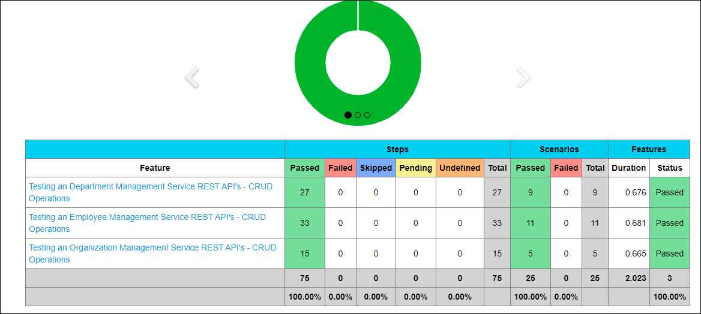</p>

<p align="center">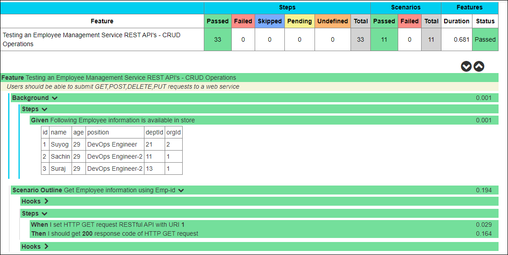</p>

How Team Works in Agile Based Project
------------------
- Business analyst or customer write the feature file
- Developer and tester (work in collaboratively) and convert file to step definitions and then start working on the features.</br>
- Project Owner conducts Scrum 15 min daily meeting to track the activity
- Project building tool is responsible for building, testing, deploying the project.   

Implementation
============
- Spring Boot
- Maven
- Ansible
- Kubernetes
- Jenkins

Spring Boot
===========

Employee Microservice
---------------------

* Extended EmployeeRepository with CrudRepository to itegrate it with MongoDB 

```java
@Repository
public interface EmployeeRepository extends CrudRepository<Employee, Long>{    
    @Query("{ 'orgId' : ?0 }")
    public List<Employee> findEmpsByOrgId(int orgId);
    @Query("{ 'deptId' : ?0 }")
    public List<Employee> findEmpsByDeptId(int deptId);
}
```

* Entity class has been annotated with @document and primary key with @id
```java
@ApiModel(description = "All details about the Employee. ")
@Document(collection = "employee")
public class Employee {

    @Id
    @Indexed
    private Long id;
```

* Then repository has been injected into Controller class using @AutoWired
```java
@RestController
@RequestMapping(value = { "/api" })
@Api(value = "Employee Management System")
public class EmployeeRestController {

    private static final Logger LOGGER = LoggerFactory.getLogger(EmployeeRestController.class);
    @Autowired
    EmployeeRepository empRepository;

    @GetMapping("/")
    public String get() {
        return "Please give url as hostname/employee/get";

    }

    @ApiOperation(value = "Get an employee by Id")
    @GetMapping("/{id}")
    public ResponseEntity<Employee> getEmpById(@PathVariable("id") Long id) throws ResourceNotFoundException {
        Employee emp = empRepository.findById(id)
                .orElseThrow(() -> new ResourceNotFoundException("Employee not found for this id :: " + id));
        return ResponseEntity.ok().body(emp);

    }
```
* Used thymeleaf template and view controller to display it on UI.

1. View Controller

```java
@Controller
@RequestMapping(value = { "/" })
public class EmployeeViewController {

    @Autowired
    EmployeeRepository empRep;

    @GetMapping("/pretty")
    public String showSignUpForm(Model model) {
        model.addAttribute("emps", empRep.findAll());
        return "show_pretty_output";
    }

}
```

2. Used Thymeleaf template in html file
```html
		<tbody>
			<tr th:if="${emps.empty}">
				<td colspan="2">CCOMS Employee Information</td>
			</tr>
			<tr th:each="emp : ${emps}">
				<td><span th:text="${emp.id}"> ID </span></td>
				<td><span th:text="${emp.name}"> Name </span></td>
				<td><span th:text="${emp.age}"> Age </span></td>
				<td><span th:text="${emp.position}"> Position </span></td>
				<td><span th:text="${emp.orgId}"> OrgId </span></td>
				<td><span th:text="${emp.deptId}"> DeptId </span></td>
			</tr>
		</tbody>
```


<p align="center">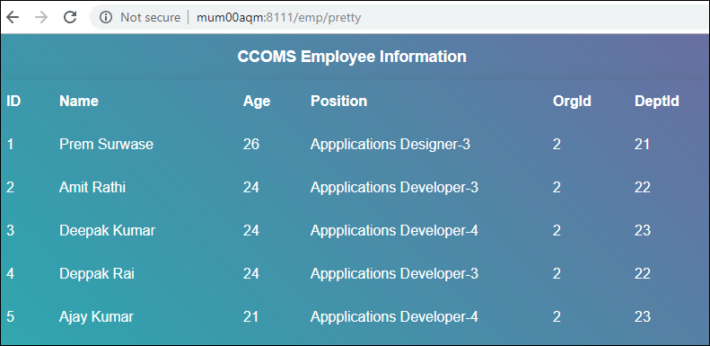</p>


Department Microservice
---------------------
Used OpenFeign Client to fetch data from Employee MicroService.
```java
@FeignClient(name = "employee-service", url = "${emp.service.url: http://localhost:8080}")
public interface EmployeeClient {

    @GetMapping("/api/dept/{deptId}")
    public List<Employee> findEmpsByDeptId(@PathVariable("deptId") Long deptId);

}
```
<p align="center">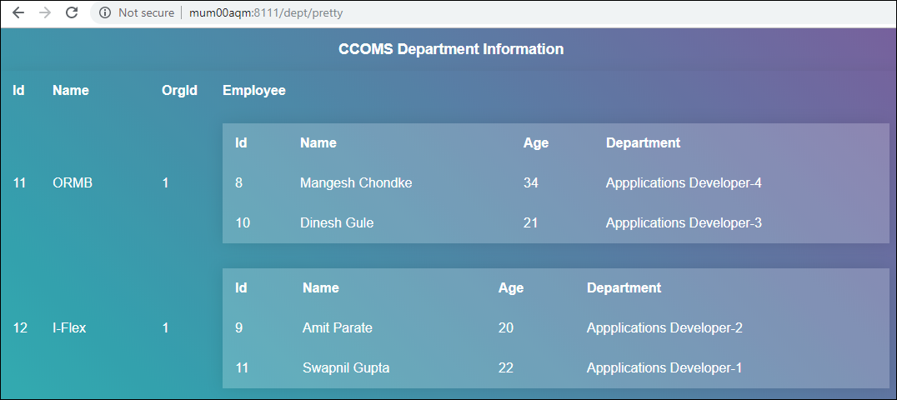</p>

Organization Microservice
---------------------
Used Openfeign client to fetch data from Department and Employee Microservice
```java
@FeignClient(name = "department-service", url = "${dept.service.url: http://localhost:8081}")
public interface DepartmentClient {

    @GetMapping("/api/org/{orgId}")
    public List<Department> findDeptsUsingOrgId(@PathVariable("orgId") Long orgId);

    @GetMapping("/api/org/{orgId}/withemp")
    public List<Department> findDeptsWithEmpsUsingOrgId(@PathVariable("orgId") Long orgId);

}
```

<p align="center">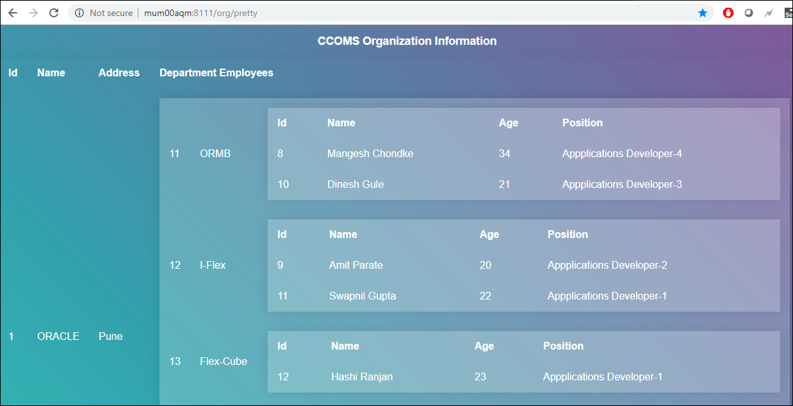</p>

Proxy Microserver (Gateway)
-----------------------------
* Used EnableZullProxy annoattion for cteating a Proxy/Gateway server.
```java
@EnableRetry
@EnableZuulProxy
@EnableSwagger2
@SpringBootApplication(exclude = { SecurityAutoConfiguration.class, ManagementWebSecurityAutoConfiguration.class })
public class ProxyServerMicroserviceApplication {

    public static void main(String[] args) {
        SpringApplication.run(ProxyServerMicroserviceApplication.class, args);
    }

    @Bean
    public Docket api() {
        return new Docket(DocumentationType.SWAGGER_2).select()
                .apis(RequestHandlerSelectors.basePackage("com.cloudcomp.ccoms.proxysvc.controller"))
                .paths(PathSelectors.any()).build().apiInfo(apiEndPointsInfo());
    }
```

* Routes are configured, as below
[Git hub link](https://github.com/svchinche/CCOMS-configfiles/blob/master/config-files/uat/zuulserver-microservice-uat.yaml)

```yaml
server:
   port: ${CCOMS_ZUUL_PORT}

zuul:
   routes:
      employee:
         path: /emp/**
         url: http://emp.ccoms.com:${CCOMS_EMP_PORT}/
         serviceId: employee-service
      department:
         path: /dept/**
         url: http://dept.ccoms.com:${CCOMS_DEPT_PORT}/
         serviceId: department-service
      organization:
         path: /org/**
         url: http://org.ccoms.com:${CCOMS_ORG_PORT}/
         serviceId: organization-service
```

* Documented REST API using Centralized Swagger
```java
@Component
@EnableAutoConfiguration
@Primary
public class RestAPIDocumentationController implements SwaggerResourcesProvider {

    @Override
    public List<SwaggerResource> get() {
        List<SwaggerResource> resources = new ArrayList<>();
        resources.add(swaggerResource("employee-service", "/emp/v2/api-docs", "2.0"));
        resources.add(swaggerResource("department-service", "/dept/v2/api-docs", "2.0"));
        resources.add(swaggerResource("organization-service", "/org/v2/api-docs", "2.0"));
        return resources;
    }
```
<p align="center"></p>


Postman utiltity to send data using Rest api's
---------------------

<p align="center">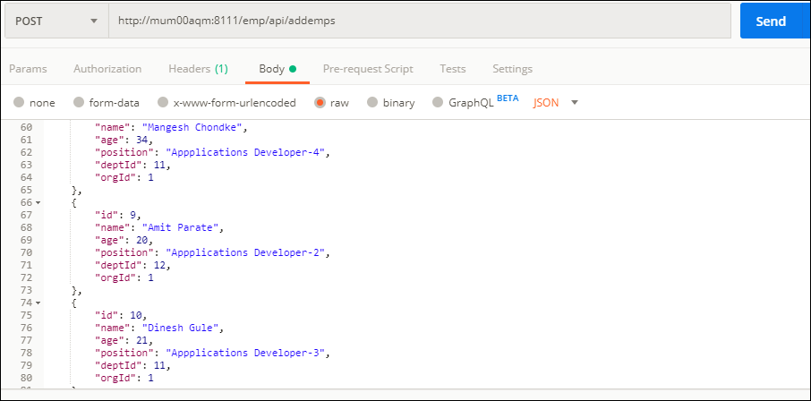</p>


Maven
=====

CCOMS is spring boot based application and built using maven. </br>
I have used multimodule project to build all microservice from one location. Generally we run maven goals rather than phases directly. </br>
Aggreated Dependency and Plugin Management into Parent Pom file.

```xml
<dependencyManagement>
        <dependencies>
            <dependency>
                <groupId>org.springframework.cloud</groupId>
                <artifactId>spring-cloud-dependencies</artifactId>
                <version>${spring-cloud.version}</version>
                <type>pom</type>
                <scope>import</scope>
            </dependency>
            <dependency>
                <groupId>io.pivotal.spring.cloud</groupId>
                <artifactId>spring-cloud-services-dependencies</artifactId>
                <version>${spring-cloud-services.version}</version>
                <type>pom</type>
                <scope>import</scope>
            </dependency>
</dependencyManagement>	
<build>
        <pluginManagement>
            <plugins>
                <plugin>
                    <groupId>org.springframework.boot</groupId>
                    <artifactId>spring-boot-maven-plugin</artifactId>
                </plugin>
            <plugins>
       <pluginManagement>
</build>
```   
For the demonstration purpose i an using install maven phase</br>

Clone github repository [https://github.com/svchinche/CCOMS.git] and then go to CCOMS/organization-management-system directory </br>
and run below command.
</br>

```linux
[root@mum00aqm organization-management-system]# mvn -Drevision=1.3 -DskipTests=true  clean:clean install
[INFO] Scanning for projects...
[INFO] ------------------------------------------------------------------------
[INFO] Reactor Build Order:
[INFO]
[INFO] cloud-comp-oms                                                     [pom]
[INFO] config-service                                                     [war]
[INFO] dept-service                                                       [war]
[INFO] emp-service                                                        [war]
[INFO] org-service                                                        [war]
[INFO] gateway-service                                                    [war]
[INFO]
[INFO] -----------------< com.cloudcomp.ccoms:cloud-comp-oms >-----------------
[INFO] Building cloud-comp-oms 1.3                                        [1/6]
[INFO] --------------------------------[ pom ]---------------------------------
[INFO] Tests are skipped.
[INFO]
[INFO] --- maven-war-plugin:3.2.3:war (default-war) @ config-service ---
[INFO] Packaging webapp
[INFO] Assembling webapp [config-service] in [/root/CCOMS/CCOMS/organization-management-system/config-service/target/ConfigServer-MicroService]
[INFO] Processing war project
[INFO]
[INFO] --- dockerfile-maven-plugin:1.4.13:tag (tag-version) @ config-service ---
[INFO] Tagging image de44e39ded7f as compucomm/config-service:1.3
[INFO] Building jar: /root/CCOMS/CCOMS/organization-management-system/config-service/target/ConfigServer-MicroService-docker-info.jar
[INFO]
[INFO] --- dockerfile-maven-plugin:1.4.13:push (tag-version) @ config-service ---
[INFO] The push refers to repository [docker.io/compucomm/config-service]
[INFO] Image f1b5933fe4b5: Layer already exists
[INFO] 1.3: digest: sha256:1987270b1da2a534921cfb89f79bedd313462f0ac48b740ccde178fa32819198 size: 1159
[INFO] ------------------------------------------------------------------------
[INFO] Reactor Summary for cloud-comp-oms 1.3:
[INFO]
[INFO] cloud-comp-oms ..................................... SUCCESS [  0.242 s]
[INFO] config-service ..................................... SUCCESS [02:06 min]
[INFO] dept-service ....................................... SUCCESS [02:44 min]
[INFO] emp-service ........................................ SUCCESS [02:42 min]
[INFO] org-service ........................................ SUCCESS [02:42 min]
[INFO] gateway-service .................................... SUCCESS [02:54 min]
[INFO] ------------------------------------------------------------------------
[INFO] BUILD SUCCESS
[INFO] ------------------------------------------------------------------------
[INFO] Total time:  13:11 min
[INFO] Finished at: 2019-11-17T16:55:15-05:00
[INFO] ------------------------------------------------------------------------
```

In command, you can see maven command is being used to create application war file.
As docker spotify plugin is entitled  with install phase, thats is why it is pushing docker image on dockerhub registry.

* I have tagged image with two tags
    * latest
    * with revision, that we passed as argument to maven
	
<p align="center">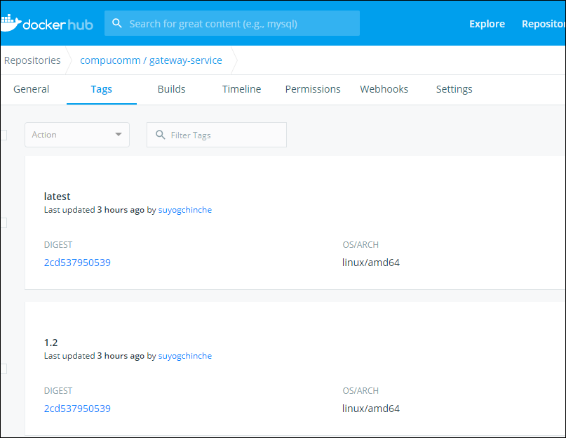</p>

Ansible
=======

Below is directory structure of ansible. it's  Self explainatory.
```
[root@mum00aqm ansible_k8s-ccoms-deployment]# tree -L 2
.
├── ansible.cfg
├── ccoms_playbook.yaml
├── environments
│   ├── 000_cross_env_vars
│   ├── dev
│   ├── prod
│   └── uat
├── prereq_verification_ccoms.sh
├── roles
│   ├── ccoms
│   ├── common
│   ├── database
│   └── preccoms
└── scripts
    ├── post_ccoms
    ├── pre_ccoms
    └── test.yaml
```

12 directories, 5 files

For more information on ansible, you can check this [link](https://github.com/svchinche/TechTopicswithBestPractices/tree/master/ansible)


Kubernetes
==========

* Yaml file for deployment
```yaml
apiVersion: apps/v1
kind: Deployment
metadata:
   name: org-ms
   namespace: ccoms
   labels:
      app: org-ms
spec:
   replicas: 3
   strategy:
      type: RollingUpdate
      rollingUpdate:
         maxSurge: 1
         maxUnavailable: 50%
   revisionHistoryLimit: 5
   selector:
      matchLabels:
         app: org-ms
   template:
      metadata:
         labels:
            app: org-ms
      spec:
         containers:
         -  name: org-ms
            image: compucomm/org-service:1.2
            imagePullPolicy: Always
            ports:
            -  containerPort: 8082
            env:
            - name: app.profile
              value: dev
            - name: CCOMS_DATABASE_USERNAME
              value: admin
            - name: CCOMS_DATABASE_PASSWORD
              value: admin123
            - name: CCOMS_DATABASE_SERVICENAME
              value: admin
            - name: CCOMS_DATABASE_PORT
              value: "27017"
            - name: CCOMS_EMP_PORT
              value: "8080"
            - name: CCOMS_DEPT_PORT
              value: "8081"
            - name: CCOMS_ORG_PORT
              value: "8082"
            readinessProbe:
               httpGet:
                  path: /pretty
                  port: 8082
               initialDelaySeconds: 120
               periodSeconds: 10
               successThreshold: 1
            livenessProbe:
               httpGet:
                  path: /pretty
                  port: 8082
               initialDelaySeconds: 120
               periodSeconds: 10
               successThreshold: 1
---
```
* Department Service
```yaml
apiVersion: v1
kind: Service
metadata:
   name: dept
   namespace: ccoms
   labels:
      app: dept-svc
spec:
   ports:
   -  port: 8081
      protocol: TCP
   selector:
      app: dept-ms
```
* Namespace
```yaml
apiVersion: v1
kind: Namespace
metadata:
  name: ccoms
```
For more information on kubernetes, go to this [link](https://github.com/svchinche/TechTopicswithBestPractices/tree/master/kubernetes)

Jenkins
=======

Automated Development, build and test process using Jenkins.
 - Used MultiBranch-Pipeline project.
 - Used Declarative and scripted section in JenkinsFile.
 - Enable web-hook to auto trigger build.
For more information on Jenkins, go to this [link](https://github.com/svchinche/TechTopicswithBestPractices/tree/master/jenkins)
 
MultiBranch-pipeline Project
----------------------
This will allows you to automatically create a pipeline for each branch on your source control repository. </br>
See below Jenkins MultiBranchPipeline Screenshot.</br>
<p align="center"></p>

Workflow of jenkins pipeline 
<p align="center">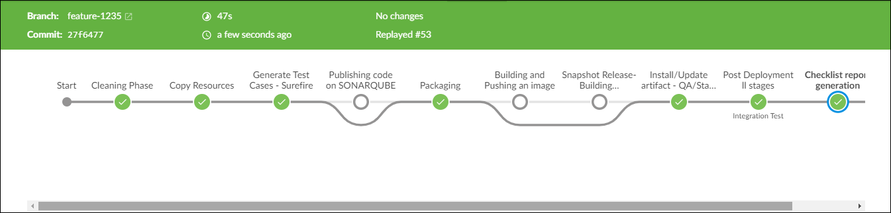</p>


Multibranch pipeline works using a Jenkinsfile, that is stored along with your source code inside a version control repository.</br>
A Jenkinsfile is nothing but a pipeline script that defines your CI pipeline.</br>

One more, benefit of using Jenkins is that, You can continue from past failed stage, Use repay feature of jenkins as shown below.
<p align="center">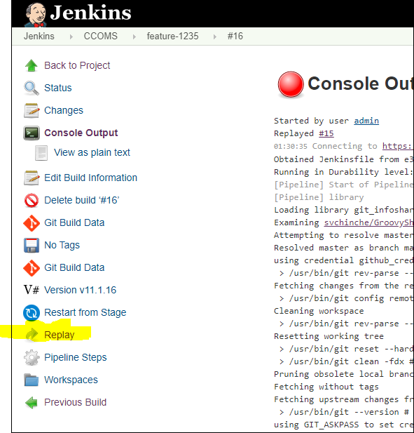</p>


Used Declarative and scripted section in JenkinsFile
---------------------------------------------------
You can see in below code snippet, i have used shared library (git_infoshared-lib) to get the recent tag information, which will be used to form the artifact id.</br>
We use groovy language to write shared library.</br>

```groovy
pipeline {

    agent {
        label 'master'
    }
    tools {
        maven 'maven'
        jdk 'jdk8'
    }

    libraries {
        lib('git_infoshared_lib@master')
    }

    environment {
        APP_NAME = "ccoms"
        APP_ROOT_DIR = "organization-management-system"
        APP_AUTHOR = "Suyog Chinche"
        GIT_URL="https://github.com/svchinche/CCOMS.git"

    }

    stages {
         
        stage('Cleaning Phase') {
            steps {
                 /* This block used here since VERSION_NUMBER env var is not initialize and we were initializing this value through shared library  */
                script {
                    env.REVISION_ID = getBuildVersion()
                }
                sh 'mvn -f ${APP_ROOT_DIR}/pom.xml -Drevision="${REVISION_ID}" clean:clean'
            }
        }
        
        stage('Copy Resources') {
            steps {
                sh 'mvn -f ${APP_ROOT_DIR}/pom.xml -Drevision="${REVISION_ID}" resources:resources  resources:testResources'
            }
        }
        
        stage('Generate Test Cases - Surefire') {
            steps {
                sh 'mvn -f ${APP_ROOT_DIR}/pom.xml -Drevision="${REVISION_ID}" compiler:compile  compiler:testCompile surefire:test'
            }

            post {
                success {
                    publishHTML([allowMissing: false, alwaysLinkToLastBuild: true, keepAll: true, reportDir: '${APP_ROOT_DIR}/config-service/target/surefire-reports', reportFiles: 'index.html', reportName: 'Unit Test Report', reportTitles: 'Unit Test Result'])
                }
            }
        }
        
        stage('Publishing code on SONARQUBE'){
            when {
                anyOf {
                    branch 'release'
                }
            }
            steps {
                sh 'mvn -f ${APP_ROOT_DIR}/pom.xml -Drevision="${REVISION_ID}" -pl .,config-service  sonar:sonar'
            }
        }
        
		 
        stage('Packaging') {
            steps {
                sh 'mvn -f ${APP_ROOT_DIR}/pom.xml -Drevision="${REVISION_ID}" -pl department-service,employee-service,gateway-service,organization-service war:war spring-boot:repackage dependency:unpack@unpack'
            }
        }
        
        stage('Building and Pushing an image') {
            when {
                anyOf {
                    branch 'release'
					branch 'hotfix'
					branch 'master'
                }
            }
            steps {
                sh 'mvn -f ${APP_ROOT_DIR}/pom.xml -Drevision="${REVISION_ID}" dockerfile:build dockerfile:tag@tag-version dockerfile:push@default dockerfile:push@tag-version'
            }
        }
		
		// In case of develop branch, QA env will be provision based on local private docker registry
		stage('Snapshot Release- Building and Pushing an image') {
            when {
                anyOf {
                    branch 'develop'
                }
            }
            steps {
                sh 'mvn -f ${APP_ROOT_DIR}/pom.xml -Drevision="${REVISION_ID}" dockerfile:build dockerfile:tag@tag-version dockerfile:push@default dockerfile:push@tag-version'
            }
        }

```

**Shared library snippet**

```groovy
def call() {

    tag_id = sh(script: "git describe --abbrev=0", returnStdout: true)?.trim()

    env.TAG_NAME = tag_id

    if ( BRANCH_NAME == 'master' || BRANCH_NAME == 'hostfix' || BRANCH_NAME == 'release' ) {
        echo "master-hotfix-release"
        env.REVISION_ID = tag_id;
        return "${TAG_NAME}"
    } else if ( BRANCH_NAME == 'develop' || BRANCH_NAME =~ /feature/ ) {
        echo "development-feature-*"
        env.REVISION_ID = "${TAG_NAME}-SNAPSHOT"
        return "${REVISION_ID}"
    } else {
        return null
    }
}
```

Enable web-hook to auto trigger build.
-------------------------------------

Sonar-Qube reports 
-------------------

<p align="center">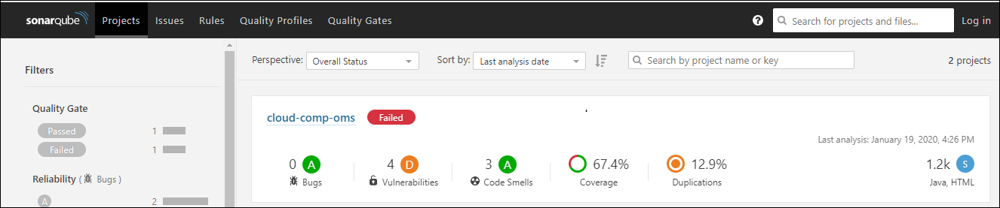</p>

Docker images 
--------------

<p align="center">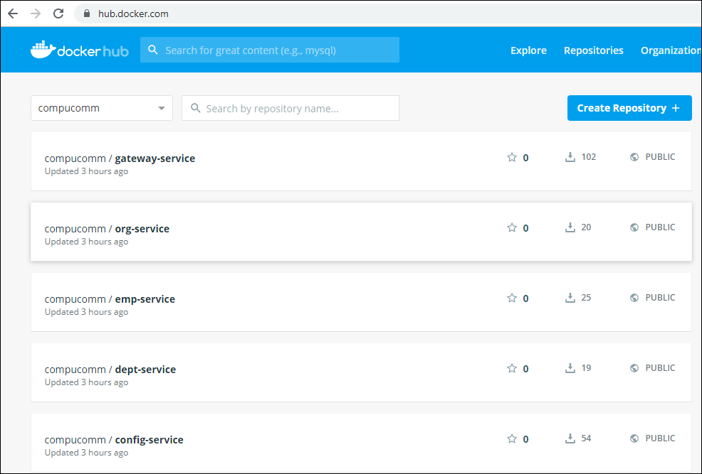</p>


Visualization of Containers
==================
Below visualization of containers, volumes has been taken from Weave-scope kubernetes plugin
<p align="center">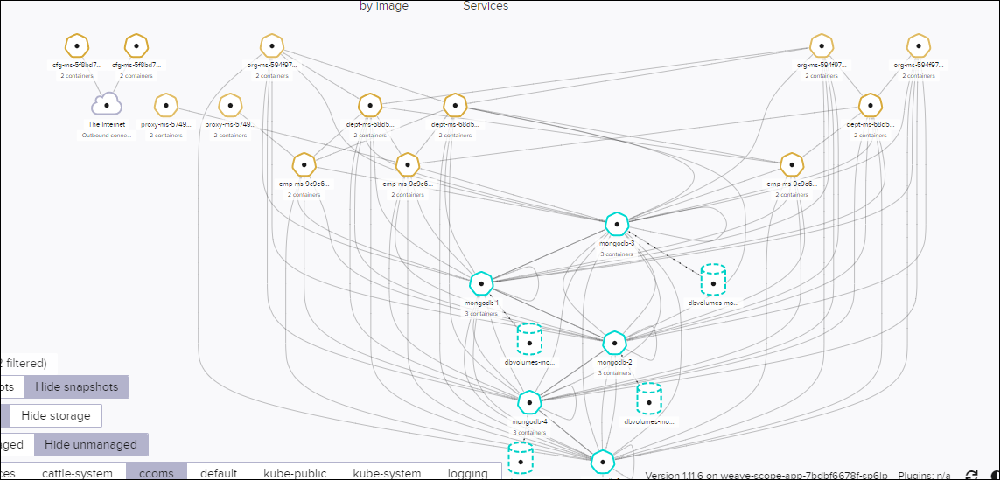</p>


Operational Activities
======================
	  
Application Deployment on k8s
-----------------------------
Below command is being used to install application on kubernetes

```linux
[root@mum00cuc ansible_k8s-ccoms-deployment]# ansible-playbook -e "ccoms_service_tag=1.2" ccoms_playbook.yaml

PLAY [Installing Kubernetes python client for ansible] ***************************************************************************************

TASK [common : Ensure Pip is installed on Proxy Based Env] ***********************************************************************************
ok: [k8s_master]

TASK [ccoms : Create CCOMS Deployment for Proxy] *********************************************************************************************
ok: [k8s_master]

PLAY RECAP ***********************************************************************************************************************************
ansible_node               : ok=1    changed=0    unreachable=0    failed=0    skipped=3    rescued=0    ignored=0
k8s_master                 : ok=18   changed=0    unreachable=0    failed=0    skipped=0    rescued=0    ignored=0
```

Application Rolling Update on k8s 
---------------------------------

* Update can be done using two ways as below
    * Recreate - This will terminate all your replica, and recreate a new deployment. Generally we use this in development environemnt.
    * Rolling - Not updating the instances at once, updating application with stages. We use this for zero downtime for keeping application available for customer . </br>
    
Below are the option that we use in rolling update
* MaxSurge : How many replicas in addition of existing replica. If we have four replicas and if you mention 50% of surge, total available replicas will be six  
* MaxUnavailable : How many pods can be unavailable. If you keep value as 1, it will terminate and update the pod one by one.
* MinimumReadySeconds : We say minimum wait when new/updated pod is ready for serving a request, ideal way would be to have ReadynessProbe
* Revision history : It keeps revision for deployment, this will help us to restore back using these revisions.
		
**Implementation** 
I have automated zero downtime patching by updating kubernetes manifest [deployment yaml] file, which is automated through ansible</br>
in below command, i have provided extra argument to update microservices with tag 1.2. and default value was latest</br>
	  
``` 
[root@ansible_node ansible_k8s-ccoms-deployment]# ansible-playbook -e "ccoms_service_tag=1.2" ccoms_playbook.yaml 
[root@mum00cuc ansible_k8s-ccoms-deployment]# grep -inr -F "ccoms_service_tag" *
environments/uat/group_vars/k8s_nodes:6:    IMAGE: config-service:{{ ccoms_service_tag }}
environments/uat/group_vars/k8s_nodes:12:    IMAGE: emp-service:{{ ccoms_service_tag }}
environments/uat/group_vars/k8s_nodes:18:    IMAGE: dept-service:{{ ccoms_service_tag }}
environments/uat/group_vars/k8s_nodes:24:    IMAGE: org-service:{{ ccoms_service_tag }}
environments/uat/group_vars/k8s_nodes:30:    IMAGE: gateway-service:{{ ccoms_service_tag }}
environments/000_cross_env_vars:2:ccoms_service_tag: latest
```

Deployment yaml or Manifest file </br>
   
```yaml
apiVersion: apps/v1
kind: Deployment
metadata:
   name: proxy-ms
   namespace: ccoms
   labels:
      app: proxy-ms
spec:
   replicas: 2
   strategy:
      type: RollingUpdate
      rollingUpdate:
         maxSurge: 1
         maxUnavailable: 50%
   selector:
      matchLabels:
         app: proxy-ms
   template:
      metadata:
         labels:
            app: proxy-ms
      spec:
         containers:
         -  name: proxy-ms
            image: compucomm/gateway-service
            imagePullPolicy: Always
            ports:
            -  containerPort: 8111
            readinessProbe:
              httpGet:
                path: /emp/pretty
                port: 8111
              initialDelaySeconds: 120
              periodSeconds: 10
              successThreshold: 1
            livenessProbe:
              httpGet:
                path: /emp/pretty
                port: 8111
              initialDelaySeconds: 120
              periodSeconds: 10
              successThreshold: 1
```

Rolling back Application on k8s
--------------------------------

**Rollback:** To go back to last working revision / Prevision 
		
As you can see, in below screenshot empty replica set of previous version is present, so why not we delete these replicas [using kubectl delete rs ]
hold on, if we delete these replica, you wont be able to rollback.
		
**You can check rolled out status, using below command**
```linux
[root@mum00aqm ~]# kubectl rollout status -n ccoms deployment cfg-ms
deployment "cfg-ms" successfully rolled out
```
		
**You can check revision history using below command**
```linux
root@mum00aqm ~]# kubectl rollout history -n ccoms deployment cfg-ms
deployment.extensions/cfg-ms
REVISION  CHANGE-CAUSE
1         <none>
2         <none>

```

**You can change image id of deployment using**
```linux
kubectl set image deployment -n ccoms proxy-ms compucomm/gateway-service=compucomm/gateway-service:1.2
```

**See the information of second last revision.**
```linux
[root@mum00aqm ~]# kubectl rollout history -n ccoms deployment proxy-ms --revision=2
deployment.extensions/proxy-ms with revision #2
Pod Template:
  Labels:       app=proxy-ms
        pod-template-hash=6f854c4b44
  Containers:
   proxy-ms:
    Image:      compucomm/gateway-service:1.2
    Port:       8111/TCP
    Host Port:  0/TCP
    Liveness:   http-get http://:8111/emp/pretty delay=120s timeout=1s period=10s #success=1 #failure=3
    Readiness:  http-get http://:8111/emp/pretty delay=120s timeout=1s period=10s #success=1 #failure=3
    Environment:
      app.profile:      dev
      CCOMS_EMP_PORT:   8080
      CCOMS_DEPT_PORT:  8081
      CCOMS_ORG_PORT:   8082
      CCOMS_ZUUL_PORT:  8111
    Mounts:     <none>
  Volumes:      <none>

```

**Its good to set change cause**
We can set a cause using annotate and record option. but that we never use. we update this using yaml manifest file. </br>
Step for creating and maintaining revision history.</br>


**Steps for rollout the last revison.**
kubectl rollout
```
[root@mum00aqm ~]# kubectl  rollout undo deployment -n ccoms
deployment.extensions/cfg-ms
deployment.extensions/dept-ms
deployment.extensions/emp-ms
deployment.extensions/org-ms
deployment.extensions/proxy-ms
```

**If you want go back to specific revision**
```
kubectl  rollout undo deployment -n ccoms cfg-ms --to-revision=2
```
where 2 is the revision id.

**Status information**
```linux
[root@mum00aqm ~]# kubectl rollout status -n ccoms deployment dept-ms
Waiting for deployment "dept-ms" rollout to finish: 2 out of 3 new replicas have been updated...
```

**Stopping and resuming update.**

Assume that you have 100's of microservices and you find that there is some issue in the deployment after applying the rollup, 
then in this case you can pause the rolling update and rollbacked to previous version
```linux 
[root@mum00aqm ~]# kubectl rollout undo deployment -n ccoms
deployment.extensions/cfg-ms
deployment.extensions/dept-ms
deployment.extensions/emp-ms
deployment.extensions/org-ms
deployment.extensions/proxy-ms
[root@mum00aqm ~]# kubectl rollout pause deployment -n ccoms
failed to patch: the server could not find the requested resource
failed to patch: the server could not find the requested resource
failed to patch: the server could not find the requested resource
failed to patch: the server could not find the requested resource
failed to patch: the server could not find the requested resource
```
**You can resume the deployment using resume command**
```linux
[root@mum00aqm ~]# kubectl rollout resume deployment -n ccoms
```

Kubernetes Cluster Deployment
-----------------------------
Kubernetes Cluster Upgrade
--------------------------
Ansible Password Rotation
----------------------------
We do not keep Vault keys as part of code repository, so these keys should be kept as secured location.
since these keys help ansible to decrypt the data from vault. so i have created a utility to generate new keys and copy to home directory 

```linux
[root@mum00cuc ansible_k8s-ccoms-deployment]# sh vault_pwdrotation.sh
Rekey successful
Rekey successful
Rekey successful
```
**Shell script is as below**
```shell
#!/bin/bash


## Uppdate home directory with new keys
rm -rf ~/.ansible_keys; cp -r ./.ansible_keys/  ~/.ansible_keys/

## take backup of existing key files
rm -rf ~/.ansible_keys_back && cp -r ~/.ansible_keys ~/.ansible_keys_back

## Remove existing files
rm -rf ~/.ansible_keys && mkdir -p ~/.ansible_keys

## Generate random passwords
tr -cd '[:alnum:]' < /dev/urandom | fold -w32 | head -n1 > ~/.ansible_keys/.vault_ccoms.dev
tr -cd '[:alnum:]' < /dev/urandom | fold -w32 | head -n1 > ~/.ansible_keys/.vault_ccoms.prod
tr -cd '[:alnum:]' < /dev/urandom | fold -w32 | head -n1 > ~/.ansible_keys/.vault_ccoms.uat

## Rekeying vault ids
ansible-vault rekey --vault-id dev@~/.ansible_keys_back/.vault_ccoms.dev --new-vault-id dev@~/.ansible_keys/.vault_ccoms.dev environments/dev/group_vars/all/vault/ccoms_db

if [ $? -ne 0 ]; then
  exit 1;
fi

ansible-vault rekey --vault-id prod@~/.ansible_keys_back/.vault_ccoms.prod --new-vault-id prod@~/.ansible_keys/.vault_ccoms.prod environments/prod/group_vars/all/vault/ccoms_db

if [ $? -ne 0 ]; then
  exit 1;
fi

ansible-vault rekey --vault-id uat@~/.ansible_keys_back/.vault_ccoms.uat --new-vault-id uat@~/.ansible_keys/.vault_ccoms.uat environments/uat/group_vars/all/vault/ccoms_db

if [ $? -ne 0 ]; then
  exit 1;
fi

## replace the new files
rm -rf ./.ansible_keys && cp -r ~/.ansible_keys ./
rm -rf ~/.ansible_keys_back
```
Application Password rotation
-------------------------------
Autoscalling of Microservices
-----------------------------
Backup and Restoration of k8s resources using Heptio Velero
-------------------------------------------

Monitoring
==========

Before going for Monitoring setup
- We need to have tiller component on kubernetes cluster.
- We need dynamic nfs provision 
 
* Tiller : 
is the service that actually communicates with the Kubernetes API to manage our Helm packages.

Using Grafana and Prometheus
----------------------------
Basically Grafana is monitoring tool and Prometheus is a visualization tool.

**Helm**
For customization on package installation using help, we used below options.
- name:  name to that package to identify on k8s cluster
- namespace: install application on newly mentioned namespace
- values:  to use our customized values using yaml file, we can use this flag
- set: to set individual attribute value

Graphana vs Kibana
------------------
Graphana- Both are the visualization tool that can be used  on top of graphite,Prometheus </br>

If you are building a monitoring system, both can do the job pretty well.  </br>
for any of the use cases that logs support — troubleshooting, forensics, development, security, Kibana is your only option. </br>

I am choosing Kibana amongst two.

Kibana, Fluent-bit, elasticsearch and Metricbeat implemntation.
----------------------------------------------------------------

Create Persistent Volume for Storing logs parmanently.

```yaml
[root@mum00aqm efk-metricbeat]# cat pv_efk.yaml
---
apiVersion: v1
kind: PersistentVolume
metadata:
  name: efk-master-volume
spec:
  storageClassName: elasticsearch-master
  capacity:
    storage: 10Gi
  accessModes:
    - ReadWriteOnce
    - ReadWriteMany
  nfs:
    server: mum00aqm
    path: /u02/pvs/master
...

---
apiVersion: v1
kind: PersistentVolume
metadata:
  name: efk-data-volume
spec:
  storageClassName: elasticsearch-data
  capacity:
    storage: 5Gi
  accessModes:
    - ReadWriteOnce
    - ReadWriteMany
  nfs:
    server: mum00aqm
    path: /u02/pvs/data
...
```

Kibana
-----
* Install elasticsearch using helm.
```
helm install stable/elasticsearch --name=elasticsearch --namespace=logs \
--set client.replicas=1 \
--set master.replicas=1 \
--set cluster.env.MINIMUM_MASTER_NODES=1 \
--set cluster.env.RECOVER_AFTER_MASTER_NODES=1 \
--set cluster.env.EXPECTED_MASTER_NODES=1 \
--set data.replicas=1 \
--set data.heapSize=300m \
--set master.persistence.storageClass=elasticsearch-master \
--set master.persistence.size=5Gi \
--set data.persistence.storageClass=elasticsearch-data \
--set data.persistence.size=5Gi
```

* Install fluent-bit 
```
helm install stable/fluent-bit --name=fluent-bit --namespace=logs --set backend.type=es --set backend.es.host=elasticsearch-client
```

* install kibana
``` 
helm install stable/kibana --name=kibana --namespace=logs --set env.ELASTICSEARCH_HOSTS=http://elasticsearch-client:9200 --set service.type=NodePort --set service.nodePort=31000
```
* install metricbeat 

Steps will be provided soon

**Screenshot::**
- Logs of CCOMS application with some fields filtered with emp microservice

<p align="center"></p>


Development Setup
==================

1. Install eclipse IDE
2. Clone and import project
3. Use openjdk 1.8 libraries
4. install lambok
5. Install mongo db
6. Add env variables in maven build
7. Run microservices one by one
8. Access and get rest apis from swagger URL
9. Debug springboot application

Install eclipse IDE
-------------------
Eclipse IDE for Enterprise Java and Web Developers (includes Incubating components) or STS

Clone and import project
------------------
* Go to </br> 
File ->import -> project from git(With smart import) ->Clone URI 
* Provide this url  </br>
https://github.com/svchinche/CCOMS.git
* and then select the branch 
* then select package explorer


Use openjdk 1.8 libraries
-------------------------
* Go to - https://www.openlogic.com/openjdk-downloads and download and untar jdk libraries in program files folder. 
* Go to </br>
Window -> Preferences -> Search for jre -> installed JRE -> update JDK path

<p align="center">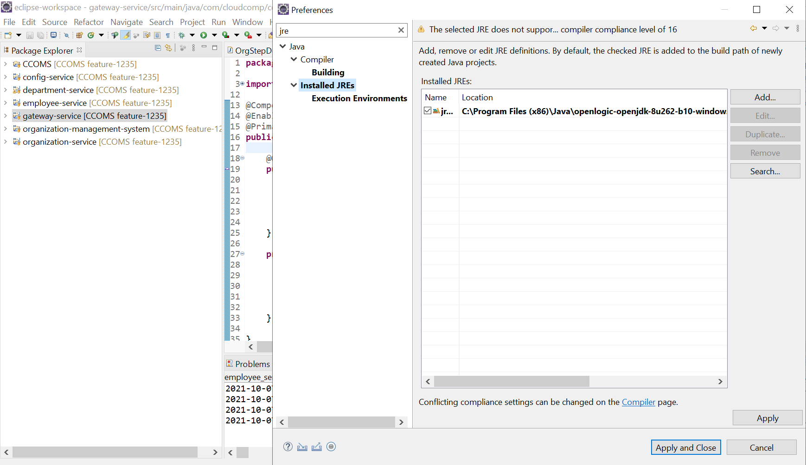</p>


Install lambok
------------

* Close your IDE 
* Download the Lombok jar from the https://projectlombok.org/download 
* Double click the jar 
* Follow the steps mentioned in the https://projectlombok.org/setup/eclipse 
* Open your IDE 
* Refer below link </br>
https://stackoverflow.com/questions/50991619/the-method-builder-is-undefined-for-the-type-builderexample


 
Install Mongo db
-----------------
Install mongo latest on windows or any linux version with version 4 </br>

**On Windows**
* Go to below link</br>
https://www.mongodb.com/try/download/community

* select --> on premises --> mongo db community server -> 3.4.23 then download/community 

* Create db folder under data directory </br>
C:\data\db 

* Go to -> C:\Program Files\MongoDB\Server\3.4\bin
  *  Double click mongod.exe to start db service  
  * Double click mongo.exe to get mongo terminal 

* Note- You can create windows shortcut to start mongodb

**Linux docker daemon, you can use below commands** 
```sh
docker run -dit -p 27017:27017 --name=mongo mongo:latest
docker exec -it mongo sh
mongo
```

* Run below commands on mongodb server 

```sh   
use admin;   
db.createUser(
  {
    user: "admin",
    pwd: "admin123",
    roles: [ { role: "readWrite", db: "admin" } ]
  }
)

```

Add Env variable in maven build
---------------------------------

* Go to Run As -> Run Configurations ->  
* Update base directory -> ${project_loc:${project_name}} 
* Goals -> spring-boot:run 
<p align="center">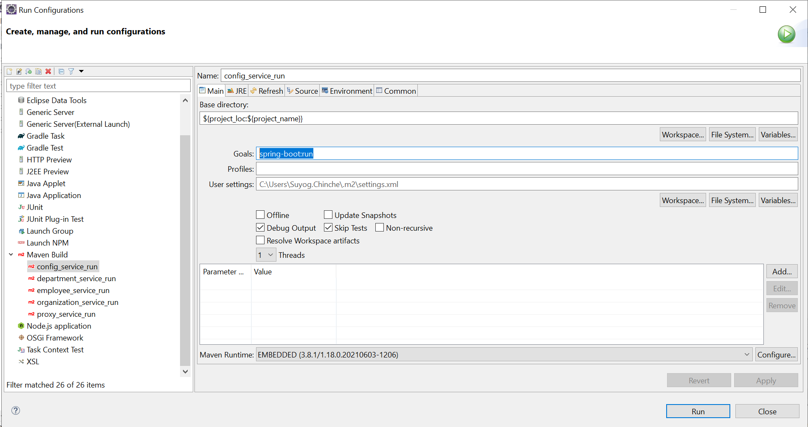</p>

*Note:* For every microservice we will have to create  maven build
<p align="center">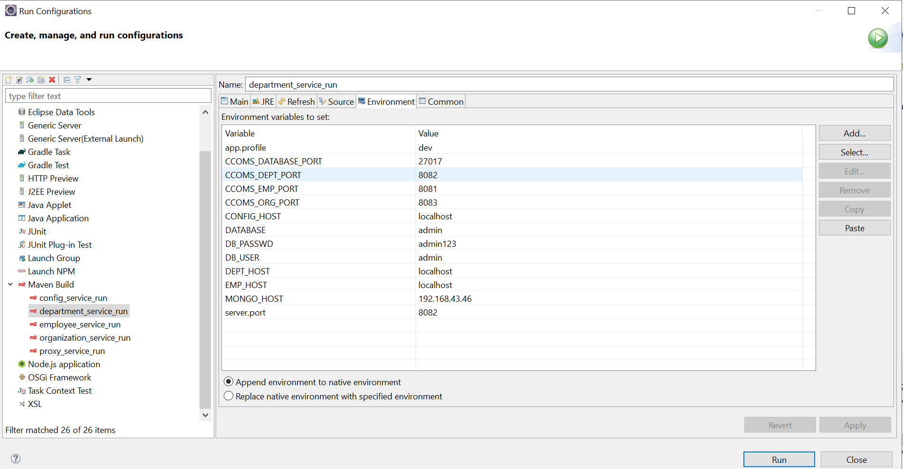</p>


**Environment variables**

```java
app.profile=dev
CCOMS_DATABASE_PORT=27017
CCOMS_EMP_PORT=8081
CCOMS_DEPT_PORT=8082
CCOMS_ORG_PORT=8083
CCOMS_ZUUL_PORT=8111
CONFIG_HOST=localhost
DATABASE=admin
DB_PASSWD=admin123
DB_USER=admin
DEPT_HOST=localhost
EMP_HOST=localhost
ORG_HOST=localhost
MONGO_HOST=localhost
server.port=8081
```

**Update MONGO_HOST and server.port for each microservice**

```
Config -- 8888 
employee-- 8081
department -- 8082
organization -- 8083
Proxy -- 8111 
```

Run microservices one by one
---------------------------
* Config
  * Run and check if below url is working or not - http://localhost:8888/employee-microservice/dev
* Employee
  * Run and check the logs, there should not be any exception in the logs
* Department
* Organization
* Proxy

* URLS for verifications
  * http://localhost:8111/swagger-ui.html 
  * http://localhost:8111/emp/pretty 
  * http://localhost:8111/dept/pretty 
  * http://localhost:8111/org/pretty 


Access and get rest apis from swagger URL
---------------------------------------
* http://localhost:8111/swagger-ui.html 

* Add data using this url and refer below link for json files
https://github.com/svchinche/CCOMS/tree/feature-1235/kubernetes/ansible_k8s-ccoms-deployment/scripts/post_ccoms/json_files </br>

* Go to -->  employee-rest-controller --> POST -> api/addemps and copy employee data from above location and try it out and finally execute </br>
similarly you can do it for other microservices.

Debug Spring boot application
------------------------------
* Add spring tools plugin from eclipse market place
<p align="center">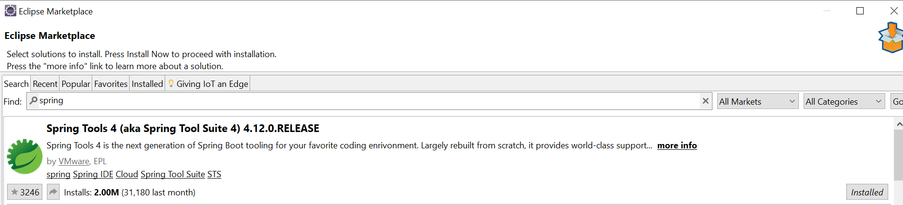</p>

* Set breakpoint for debugging

* Debug application as Spring Boot App to add entry (This has to be done once for creating run spring boot configuration)
<p align="center">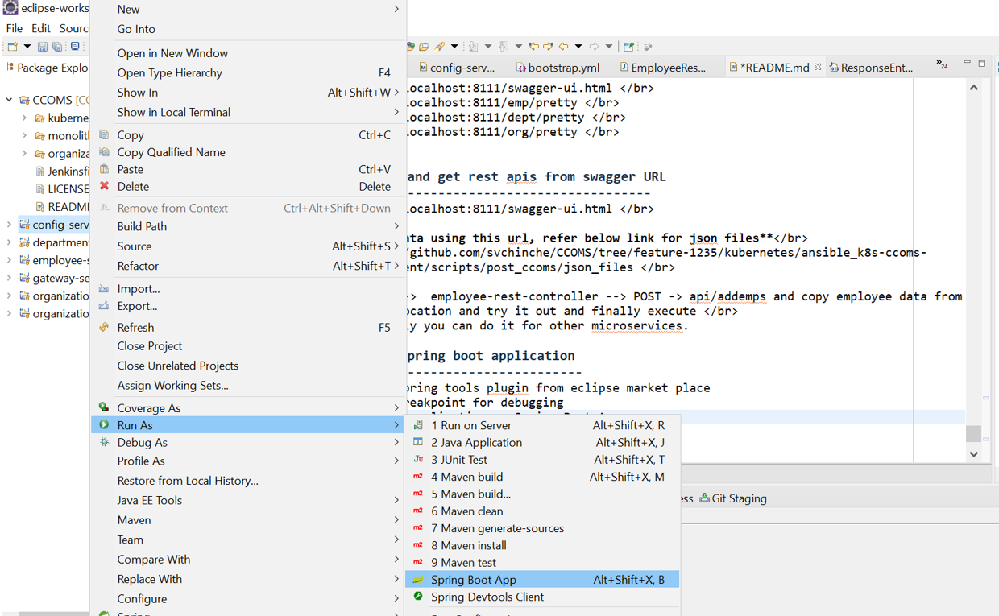</p>

* Add env variables and then run.
<p align="center">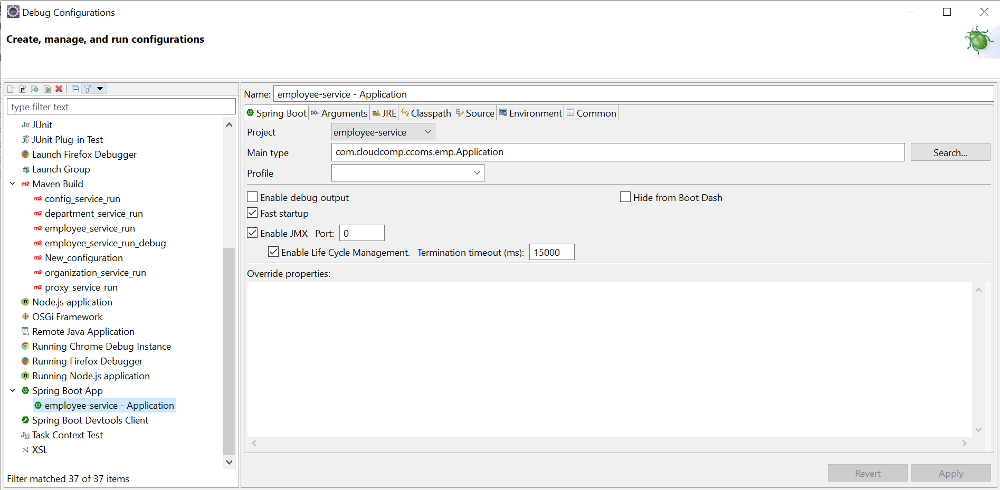</p>

    
DevOps Best Practices
======================

Objectives
==========

Everyone/Newbies should able to build a project based on Devops technology, When i was moving from Developer to Devops most of the time i was spending in building a infrastructure. for ex. I had taken almost 2-3 weeks only for creating kubernetes cluster.
If the same thing happened with newbies, they might lose there interest in devops field. Thats why i have created this project where everyone shoud take a checkout and build a project in few meenutes and start exploring devops technologies

Quote
-----
Only hard work will help you to grow
